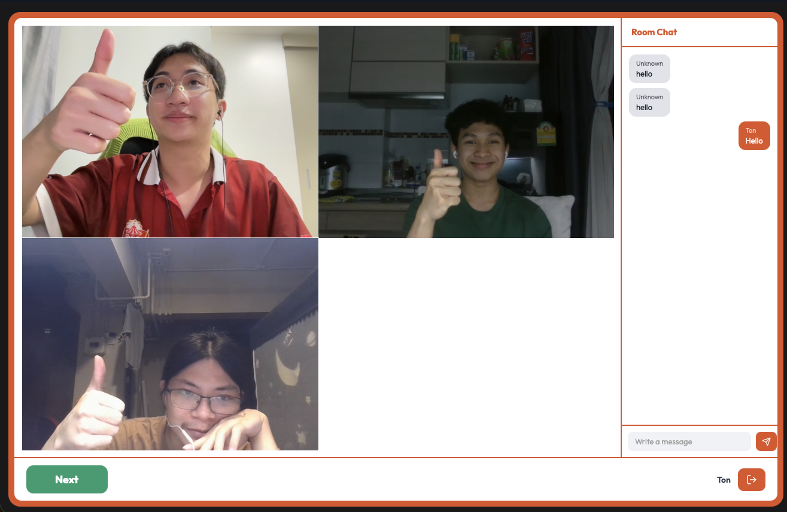

# OmeGroup
**Serverless Random Group Video Chat Platform**

## 👥 Project Members
* **Boonchai Jinaporn** | 6632110421
* **Piyongkul Rardyota** | 6632134521
* **Poonyapat Jankrajang** | 6632135121 \
**Course:** Cloud Computing Technology (2110524) \
**Chulalongkorn University**

---

## 📖 About 

OmeGroup is a high-performance, real-time video matchmaking platform that connects users with multiple strangers for seamless group conversations. Built entirely on a **serverless AWS architecture** and fully provisioned using **Terraform (Infrastructure as Code)**, the application is engineered for high concurrency and ultra-low latency.

### Performance & Optimization Achievements
* **Resource Efficiency:** Client-side memory footprint is reduced by **7–8x** compared to industry alternatives, easily handling multiple concurrent **720p** video streams via a lightweight React/Vite architecture.
* **Ultra-Low Latency:** Achieves **~0.5-second** latency—several times faster than traditional services—by leveraging native WebSockets, Rust-compiled backend handlers, and the Amazon IVS Real-Time Streaming infrastructure.
* **Cost-Effective Scaling:** Maintains highly competitive operational costs through purely event-driven compute (AWS Lambda), an ElastiCache Redis waiting pool, and automated IVS stage teardowns upon user disconnect.



---

## ⚙️ Architecture

The platform's software and infrastructure components have been designed for strict separation of concerns and high-speed execution. 

| Layer | Technologies Used | Purpose |
| :--- | :--- | :--- |
| **Frontend & UI** | React, Vite, TypeScript, Tailwind CSS | Drives the dynamic video grid and responsive layout. |
| **Auth & Video** | Amazon IVS Web SDK, AWS Cognito | Renders WebRTC stages and manages secure JWT user identity. |
| **API & Networking** | AWS API Gateway, Native WebSockets | Maintains persistent, bidirectional client connections to the queue. |
| **Backend Compute** | Rust (`cargo-lambda`), AWS Lambda | Houses the `backend`, `cron`, and `authorizer` binaries for connection handling, matchmaking, and validation. |
| **State & Storage** | Amazon ElastiCache (Redis), DynamoDB | Manages the high-speed temporary waiting pool and persistent session logs. |
| **Infrastructure** | Terraform (HCL), Amazon EventBridge | Provisions the entire VPC/AWS ecosystem and schedules the matchmaking loop. |


### Simplified Architecture Diagram


---

## 🚀 Getting Started

### 1. Infrastructure (Terraform)
1. **AWS Credentials:** Create an IAM User (`terraform-admin`) with **AdministratorAccess** in the AWS Console. Generate and copy your Access Key (CLI).
2. **Terminal Setup:** Run `aws configure` and input your Access Key, Secret Key, Default Region (`us-east-1`), and Format (`json`).
3. **Deploy:** Execute the following commands in strict order:
   * `aws sts get-caller-identity` *(Verify Identity)*
   * `terraform init` *(Initialize workspace)*
   * `terraform plan` *(Review deployment plan)*
   * `terraform apply` *(Deploy infrastructure)*

### 2. Backend Compute (Rust)
*Note: Terraform infrastructure must be deployed first.*

**Prerequisites (Windows):** `scoop install zig`, `cargo install cargo-lambda`, `pip install ziglang`, `cargo install cargo-zigbuild`

**Compile & Deploy:**
```bash
cargo lambda build --release --compiler cargo-zigbuild
cargo lambda deploy --binary-name backend class-demo-env-backend
cargo lambda deploy --binary-name cron class-demo-env-cron
cargo lambda deploy --binary-name authorizer class-demo-env-authorizer
```

### 3. Frontend Client (React)
Create a `.env.local` file at the root of the UI directory using the outputs generated by Terraform:

```env
VITE_AWS_REGION=us-east-1
VITE_COGNITO_USER_POOL_ID=us-east-1_abcedf
VITE_COGNITO_CLIENT_ID=abcedf
VITE_WEBSOCKET_URL=wss://abcdef.execute-api.us-east-1.amazonaws.com/production
```

**Run the app:**
```bash
npm install
npm run dev
```

---

## 📂 Repository Structure
* **omegroup/**: Root directory
  * **infra/**: Terraform (IaC) - Handles VPC, subnets, Cognito, DynamoDB, and API Gateway provisioning.
  * **backend/**: Rust (Serverless) - Contains the WebSocket hub and all Lambda compute handlers.
  * **ui/**: React (Edge Client) - Vite, Tailwind CSS, and IVS broadcast logic.

---

## 🛠️ Technology Stack

| Category | Tools & Technologies |
| :--- | :--- |
| **Frontend** | React, Vite, TypeScript, Tailwind CSS |
| **Backend Compute** | Rust, AWS Lambda (`cargo-lambda`) |
| **Networking & Real-Time** | Native WebSockets, Amazon IVS (Interactive Video Service) |
| **Cloud Services (AWS)** | API Gateway, Cognito, ElastiCache (Redis), DynamoDB, EventBridge |
| **Infrastructure as Code** | Terraform (HCL) |